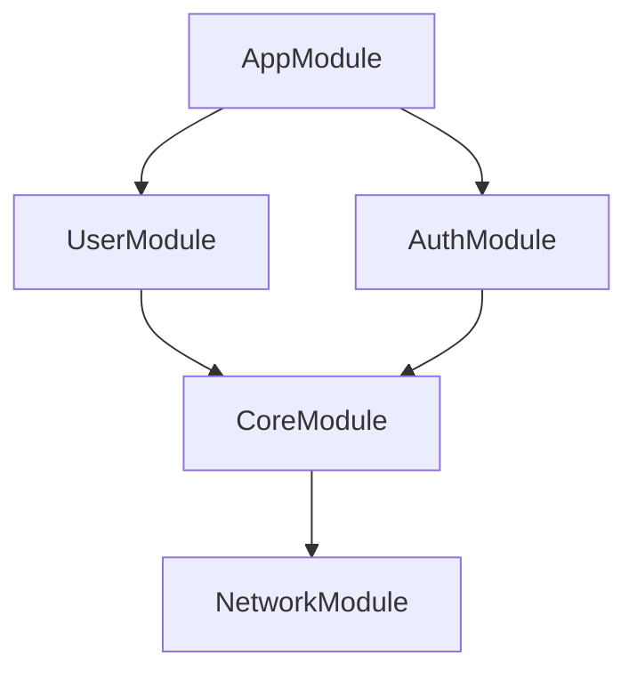

# v0.5.0 Multi-Module Analysis Plan

> **Goal:** Analyze Koin module dependencies across files and Gradle modules

**Timeline:** 2-3 weeks

---

## Overview

Current limitation: `CircularModuleDependency` only works within a single file.

**v0.5.0 adds:**
- Cross-file module dependency graph analysis
- Gradle multi-module project support
- Advanced dependency validation
- Module dependency visualization

---

## Phase 1: Cross-File Analysis (Week 1)

### Problem

Current code can't detect:

```kotlin
// file: di/UserModule.kt
val userModule = module {
    includes(authModule) // Reference to module in another file
}

// file: di/AuthModule.kt
val authModule = module {
    includes(userModule) // Circular dependency across files!
}
```

### Solution: Multi-Pass Analysis

Detekt supports custom processors that can analyze entire project:

**Task 1: Create Module Dependency Processor**

Files:
- `src/main/kotlin/io/github/krozov/detekt/koin/processors/ModuleDependencyProcessor.kt`
- `src/test/kotlin/io/github/krozov/detekt/koin/processors/ModuleDependencyProcessorTest.kt`

Features:
1. **Pass 1**: Collect all module definitions across all files
2. **Pass 2**: Build dependency graph
3. **Pass 3**: Detect cycles, orphans, missing dependencies

```kotlin
data class ModuleNode(
    val name: String,
    val file: String,
    val dependencies: Set<String>,
    val provides: Set<String> // What bindings this module provides
)

class ModuleDependencyGraph {
    private val nodes = mutableMapOf<String, ModuleNode>()

    fun addModule(node: ModuleNode)
    fun findCycles(): List<List<String>>
    fun findOrphans(): List<String>
    fun findMissingDependencies(): List<Pair<String, String>>
}
```

---

## Phase 2: Gradle Multi-Module Support (Week 2)

### Problem

Large projects split Koin modules across Gradle modules:

```
:app
  └── AppModule.kt (depends on :feature-user:userModule)
:feature-user
  └── UserModule.kt (depends on :core:coreModule)
:core
  └── CoreModule.kt
```

Can't validate:
- Module in `:app` references non-existent module from `:feature-auth`
- Circular Gradle module dependencies via Koin

### Solution: Gradle Module Metadata

**Task 2: Gradle Module Dependency Analyzer**

Files:
- `src/main/kotlin/io/github/krozov/detekt/koin/processors/GradleModuleAnalyzer.kt`

Features:
1. Parse Gradle module structure
2. Map Koin modules to Gradle modules
3. Validate cross-module references
4. Detect Gradle circular dependencies via Koin

```kotlin
data class GradleModule(
    val name: String,
    val dependencies: Set<String>, // Gradle dependencies
    val koinModules: Set<ModuleNode>
)

class GradleModuleAnalyzer {
    fun validateCrossModuleReferences()
    fun detectGradleCircularDeps()
    fun suggestMissingGradleDependencies()
}
```

---

## Phase 3: Advanced Validation Rules (Week 2-3)

### New Rules:

#### 1. **UnresolvedModuleDependency**

Detects when `includes(someModule)` references module that doesn't exist:

```kotlin
val appModule = module {
    includes(userModule) // ❌ userModule not found in project!
}
```

#### 2. **OrphanModule**

Detects modules that are never included anywhere:

```kotlin
val unusedModule = module {
    single { Service() }
} // ⚠️ Never included in any module or startKoin
```

#### 3. **DeepModuleDependency**

Warns about deep module dependency chains (> 5 levels):

```kotlin
A → B → C → D → E → F → G  // ⚠️ Too deep! Hard to maintain
```

#### 4. **MissingGradleDependency**

Gradle module uses Koin module from another Gradle module without declaring dependency:

```kotlin
// :app/AppModule.kt
val appModule = module {
    includes(userModule) // From :feature-user
}

// :app/build.gradle.kts
dependencies {
    // ❌ Missing: implementation(project(":feature-user"))
}
```

#### 5. **DuplicateModuleProvisions**

Detects when multiple modules provide same type without qualifier:

```kotlin
// userModule.kt
val userModule = module {
    single { Repository() } // ❌ Duplicate!
}

// authModule.kt
val authModule = module {
    single { Repository() } // ❌ Duplicate!
}
```

---

## Phase 4: Dependency Visualization (Week 3)

### Task 3: Generate Module Dependency Graph

Output formats:
- **DOT format** (GraphViz)
- **Mermaid** (for GitHub/Markdown)
- **HTML interactive graph**

Example output:



**Implementation:**

```kotlin
class ModuleDependencyVisualizer {
    fun generateDot(): String
    fun generateMermaid(): String
    fun generateHtml(): String
}
```

**CLI Usage:**

```bash
./gradlew detektGenerateModuleGraph
# Generates: build/reports/detekt/module-dependencies.html
```

---

## Technical Implementation

### Detekt Processor API

Detekt supports processors that run after all files are analyzed:

```kotlin
class ModuleDependencyProcessor : DetektProcessor {
    private val modules = mutableMapOf<String, ModuleNode>()

    override fun onProcess(files: List<KtFile>) {
        // Pass 1: Collect all modules
        files.forEach { file ->
            collectModules(file)
        }

        // Pass 2: Build graph
        val graph = ModuleDependencyGraph(modules.values)

        // Pass 3: Validate
        validateGraph(graph)
    }
}
```

Register in `KoinRuleSetProvider`:

```kotlin
override fun instance(): RuleSet {
    return RuleSet(
        id = "koin-rules",
        rules = listOf(/* ... */),
        processors = listOf(ModuleDependencyProcessor())
    )
}
```

---

## Configuration

New config section:

```yaml
koin-rules:
  # Multi-module analysis
  ModuleDependencyAnalysis:
    active: true
    maxDependencyDepth: 5
    warnOnOrphanModules: true
    requireGradleDependencies: true

  UnresolvedModuleDependency:
    active: true

  OrphanModule:
    active: false  # May have false positives
    excludePatterns:
      - '.*TestModule'
      - '.*PreviewModule'

  DeepModuleDependency:
    active: true
    maxDepth: 5

  MissingGradleDependency:
    active: true

  DuplicateModuleProvisions:
    active: true
```

---

## Challenges & Solutions

### Challenge 1: Module Names Are Runtime

```kotlin
val userModule = module { } // Name is "userModule" (property name)
```

**Solution:** Parse property names where module is assigned.

### Challenge 2: Dynamic includes()

```kotlin
val allModules = listOf(moduleA, moduleB)
val appModule = module {
    includes(*allModules.toTypedArray()) // Dynamic!
}
```

**Solution:** Warn on dynamic includes, suggest static list.

### Challenge 3: Performance

Analyzing all files is expensive.

**Solution:**
- Cache dependency graph
- Incremental analysis (only re-analyze changed files)
- Parallel processing

---

## Testing Strategy

### Unit Tests

Test each component:
- ModuleDependencyGraph (cycle detection, orphan detection)
- GradleModuleAnalyzer (Gradle dep validation)
- Each new rule

### Integration Tests

Create multi-file test projects:

```
test-project/
  ├── moduleA.kt
  ├── moduleB.kt
  └── moduleC.kt
```

Test scenarios:
- ✅ Detect cross-file circular dependencies
- ✅ Detect orphan modules
- ✅ Detect unresolved includes
- ✅ Generate correct dependency graph

### Real-World Validation

Test on open-source projects:
- Koin samples repository
- Real Android apps using Koin
- Ktor applications

---

## Deliverables

**v0.5.0 Ships:**

1. ✅ Cross-file module dependency analysis
2. ✅ 5 new rules (UnresolvedModule, OrphanModule, DeepDependency, MissingGradleDep, DuplicateProvisions)
3. ✅ Gradle multi-module support
4. ✅ Module dependency graph visualization (DOT, Mermaid, HTML)
5. ✅ Comprehensive documentation
6. ✅ Performance optimization (caching, incremental)

**Stats Target:**
- Tests: 289 → 350+ (+60 tests)
- Coverage: 96%+ maintained
- New files: ~8 main + ~8 test
- Documentation: Architecture guide, multi-module guide

---

## Future Enhancements (v0.6.0+)

- **Dependency graph diff**: Compare module graphs between versions
- **Auto-fix**: Generate missing `includes()` statements
- **Module architecture patterns**: Enforce layered architecture via modules
- **Performance profiling**: Identify heavy modules (many definitions)
- **Koin scopes analysis**: Validate scope dependencies across modules

---

## Getting Started

Would you like to:

**A)** Start with Task 1: Cross-file circular dependency detection
**B)** Create the overall processor infrastructure first
**C)** Design the API and write tests first (TDD)
**D)** Something else

Let me know and we can begin! 🚀
